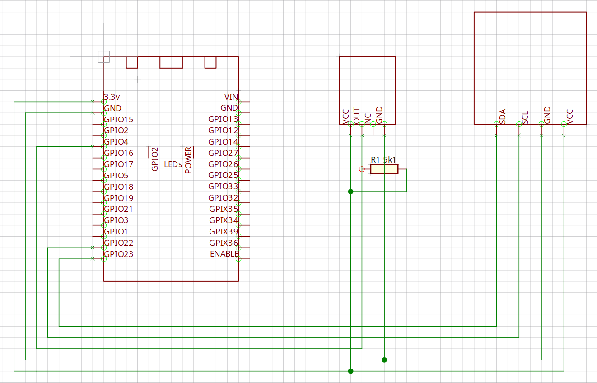

# ESP Weather

This is a repository for esp-weather, a basic weather station based on the ESP32-WROOM. It uses a DHT11 sensor and a 1306 I2C display. Your ESP32 will need to be flashed with micropython for code to execute.

Below is a diagram discription of how to wire the project up.

